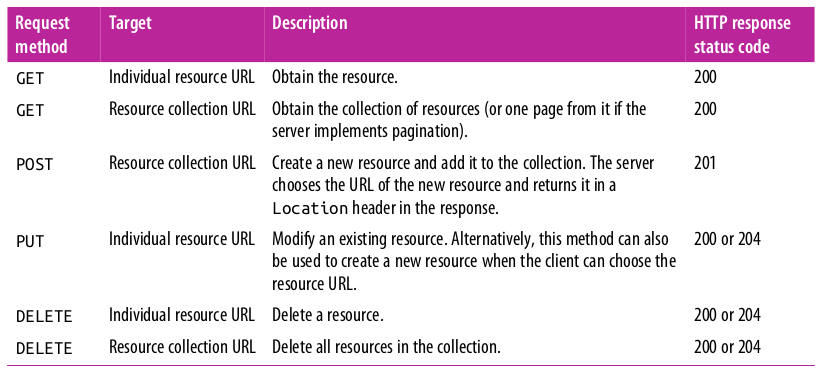
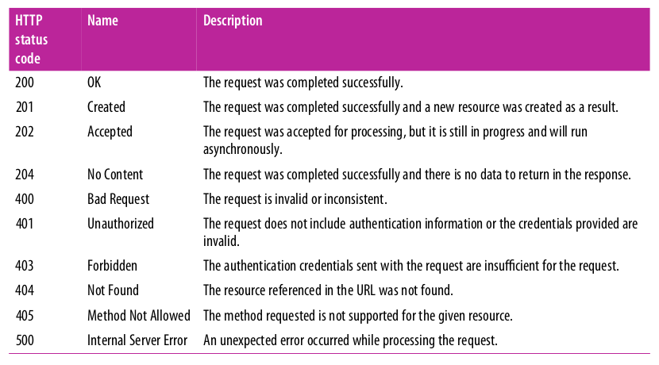

## Application Programming Interfaces

**API blueprint structure**
```bash
|-flasky
 |-app/
   |-api
    |-__init__.py
    |-users.py
    |-posts.py
    |-comments.py
    |-authentication.py
    |-errors.py
    |-decorators.py
```

#### Architectures
- RIAs -> Rich Internet Applications
- API  -> Application Programming Interface
- RCP  -> Remote Procedure Call
- SOPA -> Simplified Object Access Protocol 
- REST -> Representational State Transfer

#### Request Methods
The client application sends requests to the server at the established resource URLs and uses the request method to indicate the desired operation.

<center>
HTTP request methods in RESTful APIs
</center>



<center>
HTTP response status codes typically returned by APIs
</center>




Because the RESTful architecture is based on the HTTP protocol, HTTP authentication is the preferred method used to send credentials, either in its Basic or Digest flavor.
```bash
(venv) $ pip install flask-httpauth
```

