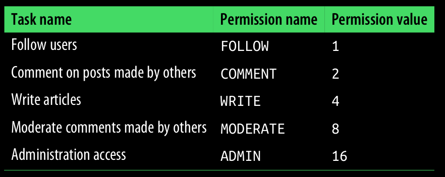
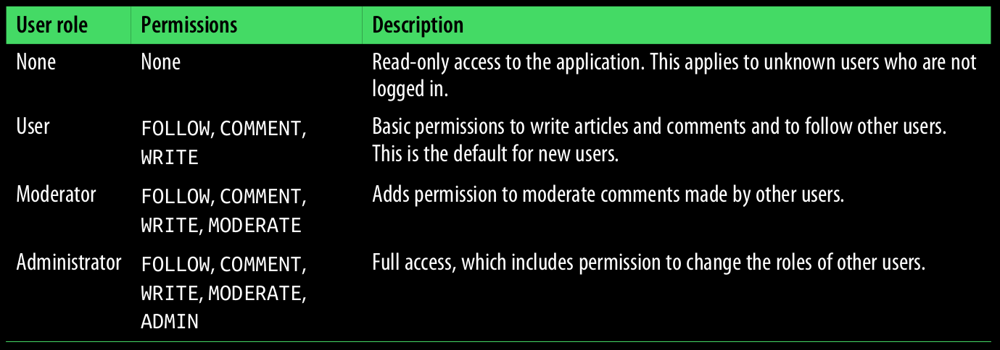

## User Roles

Not all users of web applications are created equal. In most applications, a small percentage of users are trusted with extra powers to help keep the application running smoothly.

Summary of user permissions:

#### Permissions an values

The benefit of using powers of two for permission values is that it allows permissions to be combined, giving each possible combination of permissions a unique value to store in the role’s permissions field.

User permissions are managed from the `flask shell` as methods of the Role instance.

#### Permissions and description

